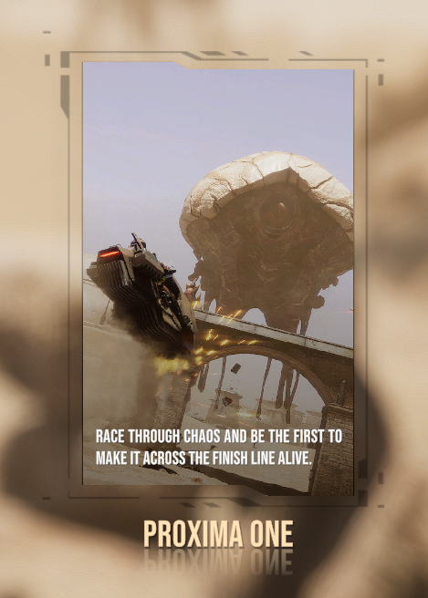

# Description

A mod to make testing a little easier. As Silica's UI is likely to undergo major changes don't expect features to work for too long. 



# Features

- Custom GameModes: Automatically load in your own prefab when Sandbox is detected on a level change or add it to the UI
- Resources: Easily load in bundles and access them from other mods

# Instructions - GameModes

1. Call `GameModes.RegisterGameMode` to add your custom GameMode. Ensure `CustomGameModeInfo.Object` contains a reference to the GameObject to be instantiated. Example:

```
QAPI.GameModes.RegisterGameMode(
    new QAPI.GameModes.CustomGameModeInfo()
    {
        DisplayName = "(Unique) Name shown in UI",
        DisplayDescription =
            "Description shown in UI",
        Object = gameModePrefab,
    }
);
```

2. That's it. If the provided `CustomGameModeInfo.Enabled` is set to `false` then you can still queue your custom GameMode by calling `GameModes.QueueGameMode` and providing it with the registered `DisplayName`. Then simply load any map with Sandbox mode.

# Instructions - Resources

Creating an Asset Bundle for Silica

1. Install Unity 2021.3.15f1 and the <a href="https://docs.unity3d.com/Manual/AssetBundles-Browser.html">AssetBundle Browser</a> tool.

2. Go to Window -> AssetBundle Browser, then configure your bundle and build it.

3. Copy the bundle to your mod's project folder and embed it by adding the following to your `Project.csproj` file:

```
<ItemGroup>
  <EmbeddedResource Include="bundle_name" />
</ItemGroup>
```

In `OnLateInitializeMelon` load the bundle or optionally retrieve the unique key:

```
Il2CppAssetBundle? bundle = QAPI.Resources.LoadBundle(bundle_name);

string bundleKey = QAPI.Resources.RegisterBundle(bundle_name);
```

Then you can access the bundle anywhere with:

```
QAPI.Resources.GetBundle(bundleKey);
```

# Changelog

**0.0.1**

- First release
